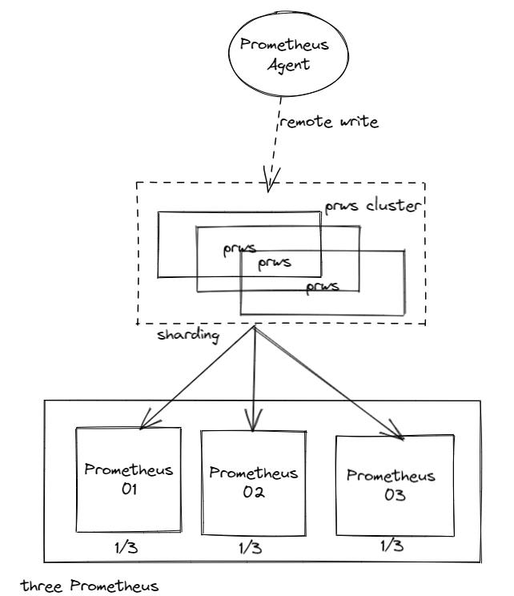
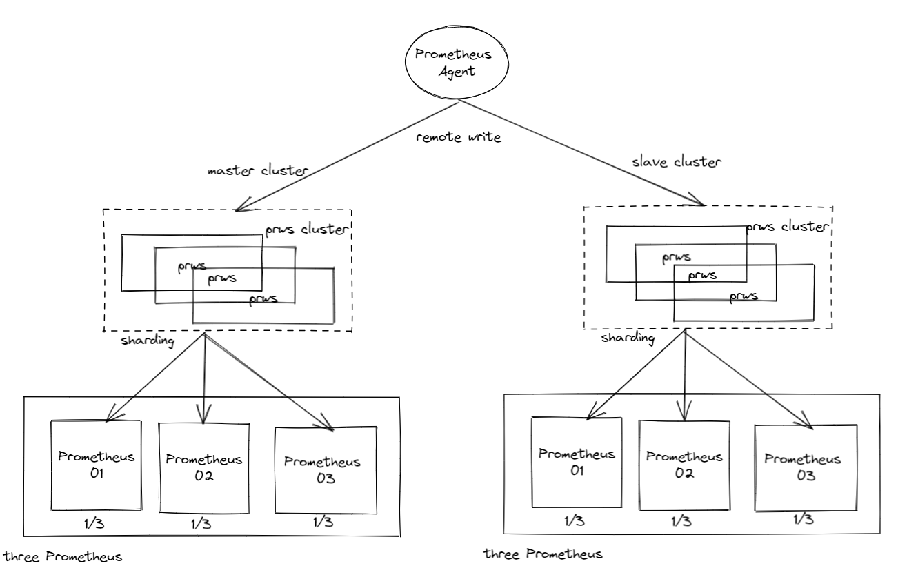
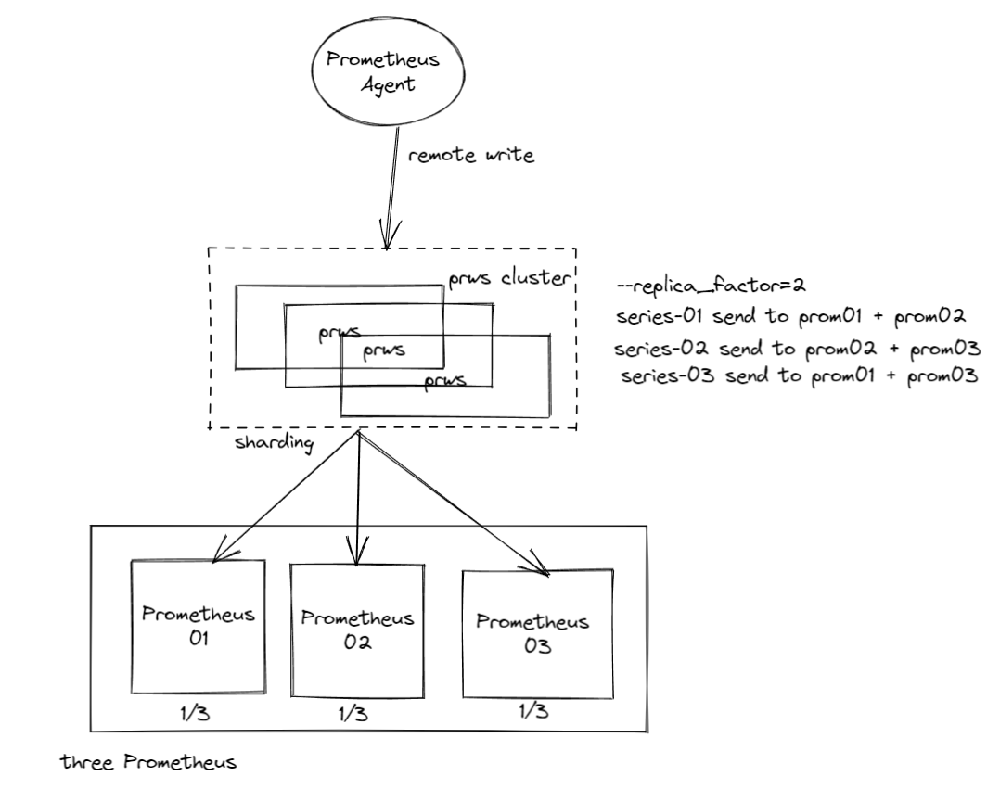

### prom-remote-write-shard 简称 prws
> 支持 Prometheus RemoteWrite 协议的一致性哈希分片 proxy；将时序数据根据分片规则分片打撒至后端 tsdb；
>
> 基于 Proxy 的 Prometheus 的高可用架构方案 （此方案需要在查询侧做 merge 支持, 推荐使用 multi remoteRead）；
>
> 支持两种分片策略，基于 metric name 的，和基于 series 的；
>


#### 架构图

> 1. 高可用分片
>
>    
>
> 2. 高可用分片 + 多副本
>
>    
>
> 3. 高可用分片 + replica_factor 复制因子
>
>    


#### 参数文档
> ```shell
> go run main.go -h
>   Usage of main.exe:
>          --batch int                      批量发送大小 (default 5000)                                                          
>         --external_labels string         添加 external_labels; env=prod,app=prom-remote-write-shard                           
>          --force_use_self_ts              是否将 series 强制设置为自身时间戳                                                   
>         --listen string                  http监听地址 (default "0.0.0.0:9999")                                                
>          --max_daily_series int           每天最多发送的 series 数量                                                           
>         --max_hourly_series int          每小时最多发送的 series 数量                                                         
>          --promes string                  prometheus地址，多台使用 , 分割                                                      
>         --remote_path string             组件接收remote write的 http path (default "/api/v1/receive")                         
>          --remote_write_min_wait int      remote write 首次重试间隔 (ms) (default 200)                                         
>         --remote_write_retry_times int   remote write 重试次数 (default 3)                                                    
>          --remote_write_timeout int       remote write 超时时间 (s) (default 5)                                                
>         --replica_factor int             数据转发的副本数, 通常小于等于后端节点数 (default 1)                                 
>          --shard int                      每个remote write的分片数,必须为2的n次方 (default 2)                                  
>         --shard_key string               根据什么来分片,metric/series (default "series")                                      
>          --v                              版本信息                                                                             
>         --watchdog                       是否开启 watchDog; 开启后会自动检测后端 promes 并根据健康状态自动加入/摘除 prome 节点
>    ```


#### 使用说明

> ```shell
> ./prom-remote-wirte-shard \
> -listen 0.0.0.0:9999 \
> -promes http://localhost:9090/api/v1/write,http://localhost:9091/api/v1/write \
> -shard_key series
> ```


#### 自监控

> ```
> # prws proxy 成功总数
> prws_series_keep_total
> 
> # prws 慢消费导致的series 失败总数
> prws_series_drop_total
> 
> # prws 每小时活跃指标超限被drop总数
> prws_hourly_series_limit_rows_drop_total
> 
> # prws 每天活跃指标超限被drop总数
> prws_daily_series_limit_rows_drop_total
> ```
>
> 项目提供 /metrics 接口供 prometheus 抓取